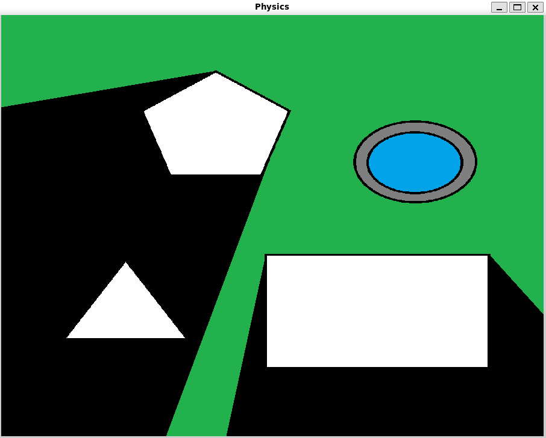

# Raycasting Lighting Engine

A lighting system using raycasting.



# Build
Debian/WSL prerequisites:
```
sudo apt-get install x11-xserver-utils maven
```

Build with Maven:
```
mvn clean package
java -jar target/Raycast-1.0-SNAPSHOT.jar
```